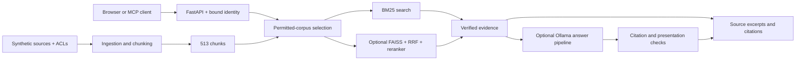

# VaultSearch

**Permission-aware search, hybrid retrieval, and an instrumented RAG red-team pipeline.**

VaultSearch searches a synthetic company's documents using the requesting identity's permissions. It combines a FastAPI backend, a local browser interface, optional Ollama-generated answers, and a four-tool MCP server. The default demo runs keyword search without downloading or loading an AI model.

## Results at a glance

| Achievement | Measured scope |
|---|---|
| **513 document chunks · 12 personas · 6 ACL groups** | Synthetic Drive-like documents, Slack-like threads, and support tickets |
| **171 passing lightweight tests** | ACLs, identity binding, retrieval primitives, citations, answer presentation, API behavior, and evaluation harness |
| **9/9 stable permission-isolation comparisons** | Three identities × three queries; identical full non-timing BM25 responses with restricted documents present versus absent |
| **8/8 recorded-answer presentation replays** | Two preserved four-case Colab rounds replayed through the presentation policy |
| **8 scripted acceptance cases** | Real API/BM25 with controlled answer fixtures |
| **Real MCP stdio-to-HTTP integration** | Tool discovery, bound identity, source excerpts, rejected credentials, disabled generation, invalid input, and recovery |
| **NDCG@10 0.865 · MRR 0.792** | Historical hybrid + cross-encoder retrieval benchmark; separate from current release checks |
| **Clean search-only installation** | Keyword retrieval and API imports without loading Torch, sentence-transformers, or FAISS |

See the [validation record](reports/release_review.md) for test provenance and the [historical retrieval table](reports/evaluation_report.md) for benchmark modes and timings. Presentation replay measures application behavior over recorded answers; it is separate from live-model evaluation.

## What is implemented

- **ACL-filtered retrieval:** expand user/group principals, select permitted documents before scoring, build BM25 statistics over that permitted corpus, and independently verify returned evidence.
- **Hybrid ranking:** BM25 + normalized FAISS vectors + reciprocal-rank fusion + cross-encoder reranking, with stable result ordering.
- **Bounded answer orchestration:** Ollama `gemma3:4b`, three internal tools, and up to two evidence-refinement rounds. Tool arguments are validated and identity is bound outside model-generated calls.
- **Evidence and citations:** full source excerpts, stable document/chunk IDs, citation allowlisting, and keyboard-accessible citation navigation.
- **Answer presentation:** flagged drafts receive a fixed application-written message while permitted evidence stays inspectable. Failure states preserve independent keyword search.
- **Red-team instrumentation:** prompt-injection fixtures, restricted-fact checks, raw/final citation analysis, source-exposure tracking, present/repeat/absent comparisons, and source-hashed evaluation artifacts.
- **MCP integration:** `search`, `ask`, `lookup_person`, and `whoami` forward through the same server-bound API identity.
- **Deployment configuration:** Docker Compose profiles and optional Terraform/LocalStack infrastructure for S3, SQS, and DynamoDB.

## Architecture



## Run the demo

Python 3.11+ is required. For a **new checkout**, open PowerShell and run:

```powershell
git clone https://github.com/NehaPrajwal1/vaultsearch.git
cd vaultsearch
python -m venv .venv
.\.venv\Scripts\python.exe -m pip install -r requirements-search.txt
.\.venv\Scripts\python.exe run_demo.py --user dmitri
```

Open **http://127.0.0.1:8000**, paste the printed demo token into **Connect**, and search `paid time off` or `Q3 infrastructure budget`. Expand a result to inspect its source text and IDs.

For an existing environment, run only the launcher. It validates the identity, corpus, and port, creates a fresh token, and starts search-only mode. It never replaces an occupied server. Stop it with **Ctrl+C**. To switch persona, restart with `--user ines` and reconnect using the new token.

```powershell
.\.venv\Scripts\python.exe run_demo.py --list-users
.\.venv\Scripts\python.exe run_demo.py --user ines --check
```

Linux/macOS use `.venv/bin/python`. The synthetic corpus is included; ingestion scripts can regenerate it if deliberately needed. The browser uses local assets and system fonts. Follow the [five-minute walkthrough](docs/demo.md).

## API and MCP

Data routes require `Authorization: Bearer <token>`. The operator configures one identity per API process; callers cannot choose another identity.

| Endpoint | Purpose |
|---|---|
| `POST /api/search` | Permitted excerpts, IDs, scores, and ranking; BM25 by default |
| `POST /api/ask` | Optional generated draft, evidence, citations, and status; disabled in search-only mode |
| `GET /api/users` | Bound identity and its permitted chunk count |
| `GET /api/directory` | Org-public names and group memberships |
| `GET /health` | API availability, search-only setting, and available retrieval modes |

Configure an MCP host to launch the project Python interpreter with the absolute path to `mcp_server.py`. Supply `VAULTSEARCH_URL=http://127.0.0.1:8000` and the matching `VAULTSEARCH_TOKEN` through the host's private environment configuration. The adapter uses stdio; the API uses HTTP. No identity argument is exposed by its four tools. The recorded integration uses the MCP Python client.

## Reproduce validation

```powershell
.\.venv\Scripts\python.exe -m pip install -r requirements-test.txt
.\.venv\Scripts\python.exe redteam/release_check.py
```

Node.js is used for the JavaScript syntax check. The bounded runner performs lightweight tests, scripted acceptance, BM25 comparisons, temporary loopback HTTP checks, and real MCP integration without invoking Ollama. Each run creates a unique ignored `.local-evaluations/release-check-*` directory. Private historical replays are optional and are reported as unavailable in a fresh clone.

[Validation details](reports/release_review.md) · [Red-team methodology](redteam/README.md) · [Evaluation runbook](RUN_SECURITY.md) · [System design](DESIGN.md)

## Optional answer and infrastructure modes

Full retrieval/answer mode uses `requirements.txt`, indexes built by `indexing/build_indexes.py`, and an explicitly configured Ollama service. Set `VAULTSEARCH_SEARCH_ONLY=false` to enable it. `AGENT_MAX_ROUNDS` accepts 0–2; `USE_RERANKER` and `USE_CRITIC` control additional model work. Use suitable hardware for these modes; the native search-only path is the validated low-memory demo.

Compose keeps Ollama under the `generation` profile and LocalStack under `cloud`; both are opt-in. Configuration is included separately from the measured native runtime results.

The corpus and evaluation fixtures are synthetic. Generated text and retrieved instructions are treated as untrusted data; citation membership establishes a permitted source label, not factual or safety approval. Evaluation scope and historical outcomes are retained in the linked methodology and validation records.

## Project map

| Path | Responsibility |
|---|---|
| `app/` | API, identity, ACLs, retrieval, orchestration, citations, and presentation |
| `web/` | Local browser UI |
| `ingestion/`, `data/` | Synthetic source generation and ACL-preserving chunking |
| `indexing/`, `eval/` | Optional vector indexes and retrieval benchmarks |
| `mcp_server.py` | Four-tool stdio adapter |
| `redteam/`, `tests/` | Evaluation harness, deterministic tests, and synthetic fixtures |
| `reports/` | Curated validation evidence |
| `cloud/` | Optional Terraform and ingestion/audit infrastructure |
